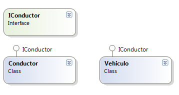
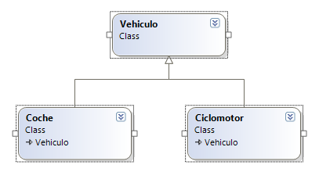
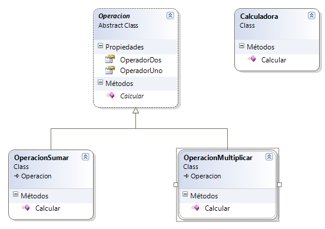

# Buenas Prácticas / Clean-Code

* [Variables](#VARIABLES)  <!-- hecho --> 
* [Funciones](#Funciones) <!-- falat 1era parte -->
* [Objetos y estructura de datos](#Objetos)  <!-- hecho --> 
* [Clases](#Clases)  <!-- hecho --> 
* [SOLID](#SOLID)    <!-- hecho --> 
* [Manejo de errores](#Errores)  <!-- hecho --> 
* [Formato](#Formato)  <!-- hecho --> 
* [Comentarios](#Comentarios) <!--hwcho-->


# VARIABLES

## 1. Utilizar nombres fáciles de pronunciar y con sentido:

A la hora de declarar variables, es preferible utilizar **nombres descriptivos**, ya que así podremos encontrarlas fácilmente, y a la hora de modificar el código, será más fácil intuir qué valores incluyen.

Mal uso:
```javascript
let tknusr = ASbh479XFR;
```

Buen uso:
```javascript
let tokenUsuario = ASbh479XFR;
```

---

## 2. Utilizar el mismo tipo de vocabulario para el mismo tipo de variables:

Si las variables tienen un **fin parecido**, es aconsejable que se llamen de **forma parecida**, para evitar errores y confusiones.

Mal uso:
```javascript
let nombreUsuario = "";
let datoTecnico = "";
let nameAdmin = "";
```

Buen uso:
```javascript
let nombreUsuario = "";
let nombreTecnico = "";
let nombreAdmin = "";
```

---

## 3. Utilizar nombres que puedan ser buscados: 

El código debe ser legible y se debe poder buscar en él, por lo que si no creamos variables significativas, estaremos entorpeciendo su lectura. Esto además puede dificultarnos encontrar posibles errores.

Mal uso:
```javascript
function calcularAreaCircunferencia(pi, radio) {
    let area = pi * Math.pow(radio, 2);
    return area.toFixed(2)
}

let area = calcularAreaCircunferencia(3.14159265359, 3);
```

Buen uso:
```javascript
function calcularAreaCircunferencia(pi, radio) {
    let area = pi * Math.pow(radio, 2);
    return area.toFixed(2)
}

const PI = 3.14159265359;
const radio = 3;

let area = calcularAreaCircunferencia(PI, radio);
```

---
## 4. Utilizar variables explicativas:

Cuando nos encontramos ante un código complejo de entender, es recomendable utilizar variables explicativas. Es decir, deben tener un nombre por el que se pueda intuir su propósito.

Mal uso:
```javascript
const direccion = "Calle Mallorca, Barcelona 95014";
const expresionRegularCodigoPostalCiudad = /^[^,\\]+[,\\\s]+(.+?)\s*(\d{5})?$/;
guardarCP(
  direccion.match(expresionRegularCodigoPostalCiudad)[1],
  direccion.match(expresionRegularCodigoPostalCiudad)[2]
);
```

Buen uso:
```javascript
const direccion = "One Infinite Loop, Cupertino 95014";
const expresionRegularCodigoPostalCiudad = /^[^,\\]+[,\\\s]+(.+?)\s*(\d{5})?$/;
const [, ciudad, codigoPostal] =
  direccion.match(expresionRegularCodigoPostalCiudad) || [];
guardarCP(ciudad, codigoPostal);
```

---
## 5. Evitar relaciones mentales:

Para entender mejor el código, nombrar variables de forma explícita es más claro y útil que hacerlo de forma implícita, ya que no podrás comprender correctamente a lo que te estás refiriendo.

Mal uso:
```javascript
const paises = ["España", "Italia", "Alemania"];
paises.forEach(a => {
  ordenarPaises();
  ponerEnMayusculas();
  //...
  //...
  dispatch(a);
});
```

Buen uso:
```javascript
const paises = ["España", "Italia", "Alemania"];
paises.forEach(ubicacion => {
  ordenarPaises();
  ponerEnMayusculas();
  //...
  //...
  dispatch(ubicacion);
});
```

---
## 6. No añadas contexto innecesario:

Si el nombre de tu clase u objeto hace alusión a algo en concreto, no es necesario repetirlo en el resto de nombres de variables o funciones.

Mal uso:
```javascript
const Movil = {
  marcaMovil: "Samsung",
  soMovil: "Android", 
  colorMovil: "Negro"
};

function ponerFundaMovil(movil){
  movil.fundaMovilColor = "Rojo";
}
```

Buen uso:
```javascript
const Movil = {
  marca: "Samsung",
  so: "Android", 
  color: "Negro"
};

function ponerFunda(movil){
  movil.funda = "Rojo";
}
```

---
## 7. Utilizar argumentos por defecto en vez de circuitos cortos o condicionales:

Al utilizar argumentos por defecto, el código se vuelve más limpio y, a la vez, se evita el uso de los cortocircuitos (||, &&, ??) que, a veces, puede alterar el valor de la variable.

Mal uso:
```javascript
function crearAppFarmacia(nombre){
  const nombreAppFarmacia = nombre || "SendSalud";
}
```

Buen uso:
```javascript
function crearAppFarmacia(nombre = "SendSalud"){
  // ...
}
```

---


## 13. Evita condicionales negativos
A la hora de hacer comparativos, comparar si es 'true' o '=='.... No compara si es no 'true' o no '=='....


Mal uso:

```javascript
if (!condicionalNegativo (negativo)) {
    // CODIGO
}
```

Buen uso:

```javascript
if (condicionalNegativo (negativo)) {
    // CODIGO
}
```
---
## 14. Evita condicionales
Se debería usar **polimorfismo** para conserguir lo mismo en la gran mayoría de los casos ya que una función debería hacer únicamente una cosa.


Mal uso:

```javascript
class Notas {
    obtenerNotas(){
        switch (this.tipo) {
            case "trimestrel":
                return this.notal()
            case "trimestrez":
                return this.nota1() + this.nota2() ::
            case "trimestre}":
                return this.notal() + this.nota2(): + this.nota3() :
        }
    }
}
```

Buen uso:

```javascript
class Notas {
}
class trimestre1 extends Notas {
    obtenerNotas(){
        return this.notal();
    }
}
class trimestre2 extends Notas {
    obtenerNotas(){
        return this.notal() + this.nota20);;
    }
}
class trimestre3 extends Notas {
    obtenerNotas(){
        return this.notal() + this. nota2() + this.nota3();
    }
}
```
---
## 15. Evita el control de tipos (parte 1)
Javascript es un **lenguaje no tipado** y por eso a veces, nos aprovechamos de eso... es por eso, que se vuelve muy tentador el controlar los tipos de los argumentos de la función. La primera solución son APIs consistentes. Por API se entiende de que manera nos comunicamos con ese módulo/función.


Mal uso:

```javascript
function organizarViaje(viaje) {
    if (viaje instanceof Viajes) {
        viaje. coche(this.local, new Destino("martos"));
    } else if (viaje instanceof Car) {
        viaje.moto(this.local, new Destino ("martos"));
    }
}
```

Buen uso:

```javascript
function organizarViaje (viaje) {
    viaje.conducir(this. local, new Destino ("martos")).
}
```
---

## 16. Evita el control de tipos (parte 2)
repetimos: **Javascript es un lenguaje no tipado**. Mantén tu código Javascript limpio, escribe tests y intenta tener revisiones de código para controlar los tipados dinámicos.


Mal uso:

```javascript
function suma (numl, num2) {
    if (typeof num1 == 'number' && typeof num2 == 'number'){
        return num1 + num2;
    }else console. log ('tienen que ser numeros')
}
```

Buen uso:

```javascript
function suma(numl, num2) {
    return num1 + num2:
}
```
---
## 17. No optimizes al máximo
Los navegadores modernos hacen mucha optimización por detrás en tiempo de ejecución. Muchas veces, al interntar optimizar tu código... estás perdiendo el tiempo.


Mal uso:

```javascript
for (let i = 0; tamaño = lista.length; i < tamaño; i++) {
    // CODIGO
}
```

Buen uso:

```javascript
for (let i = 0; i < tamaño; i++) {
    // CODIGO
}
```
---
## 18. Borra código inútil
El codigo duplicado, las funciones no usadas, comentarios desfasados... **¡BORRALAS!**

Mal uso:

```javascript
function SumaPrueba (num1, num2) {
    let suma = num1 + num2:
    return suma;
}

//esta es la nueva funcion suma
function Suma(num1, num2) {
    return num1 + num2:
}
```

Buen uso:

```javascript
function Suma(num1, num2) {
    return num1 + num2:
}
```
---


# Objetos
## Utiliza getters y setters

 Usar getters y setters para acceder a la información del objeto está mejor que simplemente accediendo a esa propiedad del objeto. ¿Por qué?
    - Si quieres modificar una propiedad de un objeto, no tienes que ir mirando si existe o no existe para seguir mirando a niveles más profundos del objeto.
    - Encapsula la representación interna (en caso de tener que comprobar cosas, mirar en varios sitios...)
    - Es sencillo añadir mensajes y manejos de error cuando hacemos get y set
    - Te permite poder hacer lazy load en caso de que los datos se recojan de una Base de Datos (bbdd)

MAL

```javascript
function newUser_Mal(){
    return {
        name: "",
        age: 0,
    }
}

let user_mal = newUser_Mal()
user_mal.name = "Alejandro Torres Castillo"
user_mal.age = 22
```
BIEN

```javascript
function newUser_Bien(){
    let name = ""
    let age = 0

    let getName = () => name
    let setName = (name) => this.name = name
    let getAge = () => age
    let setAge = (age) => this.age = age

    return{
        getName, setName,
        getAge,  setAge
    }
}

let user_bien = newUser_Bien()
user_bien.setName("Alejandro Torres Castillo")
user_bien.setAge(22)
```

## Hacer que los objetos tengan atributos/métodos privados

Esto se puede hacer mediante clojures (de ES5 en adelante). 

MAL
```javascript 
const EMPLOYEE = (name) => this.name = name

EMPLOYEE.prototype.getName = function getName() { 
    return this.name 
}

const  employee_mal = new EMPLOYEE("Alfredo")
console.log(employee_mal.getName()) // Alfredo
delete employee_mal.name
console.log(employee_mal.getName()) // undefinde
```

BIEN
```javascript
function createEmployee(name){
    return {
        getName(){
            return name;
        }
    }
}

const  employee_bien = createEmployee("Alfredo")
console.log(employee_bien.getName()) // Alfredo
delete employee_bien.name
console.log(employee_bien.getName()) // Alfredo
```


# Clases
## Añadir las propiedades/funciones de una clase al crearla
Es muy complicado de conseguir que un código sea entendible y fácil 
de leer con herencia de clases, construcción y metodos típicos de clases
con las clases de ES5. Si necesitas herencia (y de seguro, que no la necesitas)
entonces, dale prioridad a las clases ES2015/ES6. De todas las maneras, 
deberías preferir pequeñas funciones antes que ponerte a hacer clases. 
Solo cuando tengas un código largo o cuando veas necesaria la implementación de clases, añádelas.

MAL
```javascript
const Animal = function(patas){
    if(!(this instaceof Animal)) throw new Error("Inicializa Animal con `new`");

    this.patas = patas;
};

Animal.prototype.andar = function andar() {};
```

BIEN
```javascript
class Animal {
    constructor(patas){
        this.patas = patas;
    }

    andar(){
        /* ... */
    }
}
```

## Si no devuelve nada la función, devolver el mismo objeto
Este es un patrón útil en Javascript y verás que muchas librerías
como jQuery o Lodash lo usan. Permite que tu código sea expresivo
y menos verboso. Por esa razón, utiliza las funciones anidadas y 
date cuenta de que tan limpio estará tu código. En las funciones 
de tu clase, sencillamente retorna this al final de cada una y con
eso, tienes todo lo necesario pra poder anidar las llamadas a las funciones.

MAL
```javascript
class Churreria {
    constructor(localidad, logotipo){
        this.localidad = localidad;
        this.logotipo = logotipo;
    }

    cambiarLugar(localidad){
        this.localidad = localidad;
    }

    cambiarLogo(logotipo){
        this.logotipo = logotipo;
    }
}

let churreria = new Churreria("Martos", "El café bien negro");
churreria.cambiarLogo("Siempre entra");
churreria.cambiarLugar("TorredelCampo");
```

BIEN
```javascript
class Churreria {
    constructor(localidad, logotipo){
        this.localidad = localidad;
        this.logotipo = logotipo;
    }

    cambiarLugar(localidad){
        this.localidad = localidad;
        return this;
    }

    cambiarLogo(logotipo){
        this.logotipo = logotipo;
        return this;
    }
}

let churreria = new Churreria("Martos", "El café bien negro");
churreria.cambiarLogo("Unos cuantos entran solo a comer").cambiarLugar("Rute");
```

## Prioriza la composición en vez de la herecia
Como se citó en Patrones de Diseño por "the Gang of Four", deberías priorizar la composición en vez de la herecia siempre que puedas. Hay muy buenas razones para usar tanto la herecia como la composición. El problema principal es que nuestra mente siempre tiende a la herencia como primera opción, pero deberíamos de pensar qué tan bien nos encaja la composición en ese caso particular porque en muchas ocasiones es lo más acertado.

Te estarás preguntando entonces, ¿Cuando debería yo usala herencia? Todo depende. Depende del problema que 
tengas entre mano, pero ya hay ocasiones particularedonde la herencia tiene más sentido que la composición:
- Tu herencia representa una relación "es un/a" en vez de "tiene un/a" 
(Humano->Animal vs. Usuario->DetallesUsuario)
- Puedes reutilizar código desde las clases base 
(Los humanos pueden moverse como animales)
- Quieres hacer cambios generales a clases derivadacambiando la clase base. 
(Cambiar el consumo de calorías a todos los animales mientras se mueven)

MAL
```javascript 
class Rueda {
    constructor(diametro, desgaste) {
        this.diametro = diametro
        this.desgaste = desgaste    
    }
    rodar = () => this.degaste++
}

// Mal porque un Coche no tiene los mismos atributos que la Rueda
class Coche extends Rueda {
    constructor(motor, km) {
        super();
        this.motor = motor;
        this.km = km;
    }
} 
```
BIEN
```javascript 
// Sin modificar la clase rueda la usamos con agregacion y sin recurrir a la herencia 
class Coche{

    constructor(motor, km) {
        this.motor = motor;
        this.km = km;
        this.ruedas = []
    }
    
    cambiarRuedas = function(index, diametro, desgaste){
        this.ruedas[index] = new Rueda(diametro, desgaste)
    }
}
```


# SOLID


## SRP
El primer principio de SOLID llamado Principio de Responsabilidad Única indica que una clase debería ser responsable de una única funcionalidad. En otras palabras, la clase solo debería tener una única razón para cambiar.


### Beneficios del principio de responsabilidad única:

```

  1. En relación al testing. Se simplifica 
        porque una clase tiene una única responsabilidad... 

  2. Se disminuye el acoplamiento pirque menor funcionalidad 
        en una clase hará que esta tenga menos dependencias. 
        
  3. La organización de las clases y los paquetes 
        será mejor y más sencillo.

```


### Mal uso

```java

package solid;

class UserLogin {

    private final DataBase db;

    UserLogin(DataBase db){
      this.db = db;
    }

    void login (String userName, String password) {
      User user = db.findUserByUserName(userName);
      if (user == null){
        //do something
      }
      //login process
    }

    void sendMail (User user, String msg){
      //send email to user
    }


}

```

\
Esta clase UserLogin tiene como responsabilidad realizar el proceso de login pero además le dimos la responsabilidad de de enviar mensajes al usuario.
Este código viola el principio de responsabilidad unica. Está haciendo dos cosas con objetivos diferentes.


### Buen uso

```java

package solid;

class EmailSender {

    void sendMail (User user, String msg){
      //send email to user
    }

}

```

\
¿Entonces qué deberíamos hacer?

Sería conveniente separar la clase en dos. Una para lo específico del login y otra para la funcionalidad de envío de mensajes.


## OCP  
El Principio de Abierto-Cerrado, del inglés "The Open-Close Principle (OCP)", nos viene a decir que cualquier entidad software (clases, módulos, funciones, etc.) debe de estar abierta para ser extendida en funcionalidad pero cerrada para ser modificada. Es decir, una clase que cumpla con OCP tiene estas dos características:


```

  1. La funcionalidad del módulo puede cambiarse o extenderse
                en base a los cambios que requiera el sistema.

  2. Extender la funcionalidad de un módulo no implica
        cambios en el código fuente de ese módulo en sí mismo.

```


\


En este caso, la interfaz [IConductor] es la abstracción que define la clase [Conductor] para conducir un [Vehículo]. Observa que la interfaz se llama [IConductor]en lugar de IVehículo porque el que define la funcionalidad es el [Conductor] mientras que [Vehículo] es únicamente una implementación de esa interfaz. Para implementar el cambio que restringe que un [Conductor] sólo puede conducir vehículos a motor bastaría únicamente con cambiar la implementación de [Vehículo] para justarse a las nuevas necesidades.

Con este diseño, la clase [Conductor] cumple con OCP, pues está abierta a cambios (respecto a conducir vehículos) y cerrado a los cambios (para cambiar el comportamiento de los vehículos, no se necesita cambiar el comportamiento del conductor).Otro tema sería que los cambios que se pidieran no fuesen soportados por la interfaz disponible. Por ejemplo, tener en cuenta vehículos voladores. En este caso los cambios serían a nivel de requerimientos de más alto nivel, por lo que se entiende que no quede más remedio que cambiar la clase [Conductor], la interfaz [IConductor], y evidentemente todas las implementaciones de esta interfa


## LSP
El principio de sustitución de Liskov nos dice que si en alguna parte de nuestro código estamos usando una clase, y esta clase es extendida, tenemos que poder utilizar cualquiera de las clases hijas y que el programa siga siendo válido.


```

  1. Esto nos obliga a asegurarnos de que cuando extendemos 
               una clase no estamos alterando el comportamiento de la padre.

  2. Este principio viene a desmentir la idea preconcebida de
               que las clases son una forma directa de modelar la realidad, y que
               hay que tener cuidado con esa modelización.

```


\


Este es un ejemplo de LSP ya que deberíamos poder cambiar las clases [Vehículo], por sus hijas sin que se den errores y problemas.


\

Este es un ejemplo de LSP bien hecho ya que podemos cambiar la  [Operacion] a placer sin que se den errores, un mal ejemplo habría sido uno donde en vez de tener "Operador1" y "Operador2" tendría funciones como "suma" o "resta".


## ISP
El principio nos indica que una clase debe de implementar únicamente las interfaces que necesita, es decir, que no necesite tener que implementar métodos que no utilice. Se aplica a una interfaz amplia y compleja para escindirla en otras más pequeñas y específicas, de tal forma que cada cliente use solo aquella que necesite.

Imaginemos que tenemos un negocio de venta de ordenadores de escritorio, sabemos que todas las ordenadores deberían de extender de la clase Ordenador y tendríamos algo como esto:


```js

class Ordenador {
  marca;
  modelo;

  constructor(marca, modelo) {
    this.marca = marca;
    this.modelo = modelo;
  }

  obtenerMarca() {
    return this.marca;
  }

  obtenerModelo() {
    return this.modelo;
  }

  guardarMarca(marca) {
    this.marca = marca;
  }

  guardarModelo(modelo) {
    this.modelo = modelo;
  }
}

class Portatil extends Ordenador {
   ...
}

```

En nuestro negocio todo va de maravilla y ahora queremos extender un poco más nuestro catalogo de productos, así que decidimos optar por empezar a vender ordenadores portátiles. Un atributo útil de un portátil es el tamaño de la pantalla integrada, pero como bien sabemos esto solo esta presente en los portátiles y no ordenadores de escritorio (generalizando), podemos hacer esto:

```js

  class Ordenador {
  marca;
  modelo;

  constructor(marca, modelo) {
    this.marca = marca;
    this.modelo = modelo;
  }

  obtenerMarca() {
    return this.marca;
  }

  obtenerModelo() {
    return this.modelo;
  }

  guardarMarca(marca) {
    this.marca = marca;
  }

  guardarModelo(modelo) {
    this.modelo = modelo;
  }
}

const Portatil = (clasePadre) => {
  return (
    class extends clasePadre {
      constructor(marca, modelo){
        super(marca, modelo);
      }

      guardarTamanioPantalla(tamanio) {
        this.tamanio = tamanio;
      }

      obtenerTamanioPantalla() {
        return this.tamanio;
      }

    }
  )
}

```

## DIP
En este principio se establecen que las dependencias deben de estar en las abstracciones y no en las concreciones, en otras palabras, nos piden que las clases nunca dependan de otras clases y que toda esta relación debe estar en una abstracción. Este principio tiene dos reglas:


```

  1. Los módulos de alto nivel no deben de depender de módulos de bajo nivel. Esta lógica debe de estar en una abstracción.

  2. Las abstracciones no deben de depender de detalles. Los detalles deberían depender de abstracciones. 

```


  
Imagina que tenemos una clase que nos permite enviar un correo:


```js

  class Correo {
  provider;

  constructor() {
    // Levantar una instancia de google mail, este código es con fin de demostración.
    this.provider = gmail.api.createService();
  }

  enviar(mensaje) {
    this.provider.send(mensaje);
  }
}

var correo = new Correo();
correo.enviar('hola!');

```
\
En este ejemplo se puede ver que se está rompiendo la regla, puesto que la clase correo depende del proveedor de servicio, ¿qué pasaría si después queremos usar Yahoo y no Gmail?

Para solucionar esto debemos eliminar esa dependencia y añadirla como una abstracción.

```js

  class GmailProveedor {
  constructor() {
    // Levantar una instancia de google mail, este código es con fin de demostración.
    this.provider = gmail.api.createService();
  }
  enviar(mensaje) {
    this.provider.sendAsText(mensaje);
  }
}
class Correo {
  constructor(proveedor) {
    this.proveedor = proveedor;
  }
  enviar(mensaje) {
    this.proveedor.send(mensaje);
  }
}
var gmail = new GmailProveedor();
var correo = new Correo(gmail);
correo.enviar('hola!');

```

De esta forma ya no nos importa el proveedor ni la forma en que implementa el envío de correos el proveedor, la clase de Correo solo se ocupa de una única cosa, pedirle al proveedor que envíe un correo.


# Errores

## 1. No ignores los errores capturados:

El uso de try/catch hace que tengas que elaborar un plan de reacción a aquellos errores y no ignorarlos con un simple console.log(), que no aporta ninguna solución.


Mal uso:
```javascript
try{
    lanzaError();
}catch(error){
    console.log(error);
}
```

Buen uso:
```javascript
try{
    lanzaError();
}catch(error){
    // Console.error es más apropiado para mostrar un error que el Console.log
    console.error(error);
    // Para hacer más real la visibilidad del error
    informarAlUsuario(mensaje, error);
}
```

---

## 2. No ignores las promesas rechazadas:

Las promesas encadenadas son excelentes manejando errores. Cuando una promesa es rechazada, el control salta al manejador de rechazos más cercano. Por eso no es conveniente ignorarlas.

Mal uso:
```javascript
obtenerInformacion()
    .then(info => {
        lanzaError(info);
    })
    .catch(error => {
        alert(error);
    });
```

Buen uso:
```javascript
obtenerInformacion()
    .then(info => {
        lanzaError(info);
    })
    .catch(error => {
        console.error(error);
        informarAlUsuario(error);
    });
```


# Formato
## 1. Usa consistenemente la capitalización
Define unas **reglas de capitalización** con tu equipo y sed constantes.


Mal uso:

```javascript
    let num1;
    let NUM2;

    function sumayresta() { }
    function multiplicaydivide() { }
    
    class Perro { }
    class GATO { }
```

Buen uso:

```javascript
let num3;
let numz;

function sumaYresta() { }
function multiplicaYdivide) { }

class Perro { }
class Gato { }
```
---
## 2. Funciones que llaman y funciones que son llamadas, deberían estar cerca
Si una función llama a otra, haz que esta función que va a ser llamada **esté lo más cerca posible** de la función que la llama. Idealmente, situa siempre la función que va a ser llamada justo después de la función que la ejecuta.


Mal uso:

```javascript
class Calculadora {
    suma(num1, num2) {
        //codigo
    }
    resta(numl, num2) {
        //codigo
    }
    operaciones(){
        this-suma(1, 2);
        this.resta(1, 2);
        this.multiplica(1,2);
    }
    multiplica (num1, num2) {
    //codigo
    }
}


```

Buen uso:

```javascript

class Calculadora {
    operaciones(){
        this-suma(1,2);
        this.resta(1, 2);
        this.multiplica(1,2);
    }
    suma (num1, num2) {
        //codigo
    }
    resta(numl, num2) {
        //codigo
    }
    multiplica (num1, num2) {
        //codigo
    }
}


```


# Comentarios
## 1. Comenta únicamente la lógica de negocio que es compleja
Se dice que un buen código debería comentarse por si mismo. **Comentaremos solo logicas que consideremos complejas**


Mal uso:

```javascript
    
//valor 1
let n1;

//valor2
let n2;

//funcion que devuelve un suma
function s(n1, n2) {
    return n1 + n2:
}


```

Buen uso:

```javascript

let numerol;
let numeroz;

//funcion que devuelve un suma
function suma (numerol, numero2) {
    return numero1 + numero2;
}


```
---
## 2. No dejes código comentado en tu repositorio
Si comenta un código porque en breves o algun día lo vas a necesitas... **borralo**. El código que borres consta en alguna de tus versiones de tu código fuente, **usa git**


Mal uso:

```javascript

function suma() { }

//function resta()) {}

//function divide () {}


```

Buen uso:

```javascript
function suma() { }

//function resta()) {}

//function divide () {}
```
---
## 3. No hagas un diario de comentarios
No hay motivo alguno para tener código muerto, código comentado y aún menos, un diadrio o resumen de modificaciones en tus comentarios.


Mal uso:

```javascript
/**
* 2022-10-25: funcion resta terminada
* 2022-10-01: funcion divide terminada
* 2022-10-03: funcion multiplica terminada
*/

function suma(a, b) {
    return a + b;
}
```

Buen uso:

```javascript
function suma(a, b) {
    return a + b;
}
```
---
## 4. Evita los marcadores de secciones
Evidente, el nombre de las propias variables, fuciones, clases... deberian de ser lo **suficientemente claro** para ser entendible

Mal uso:

```javascript
/////////////////////////////////////////////
//Funcion suma
/////////////////////////////////////////////
function suma(a, b) {
    return a + b:
}

/////////////////////////////////////////////
//Funcion resta
/////////////////////////////////////////////
function resta(a, b) {
    return a - b;
}
```

Buen uso:

```javascript
function suma(a, b) {
    return a + b:
}

function resta(a, b) {
    return a - b;
}
```
---

